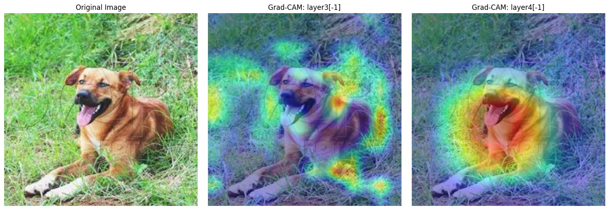
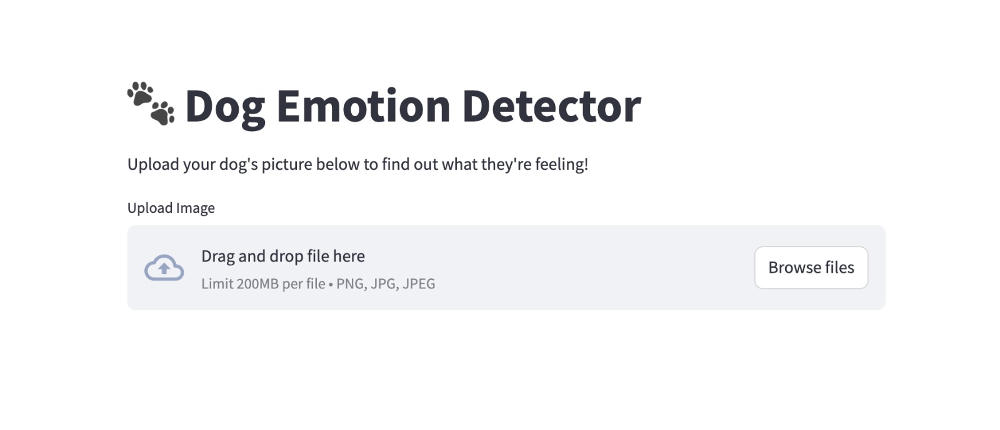
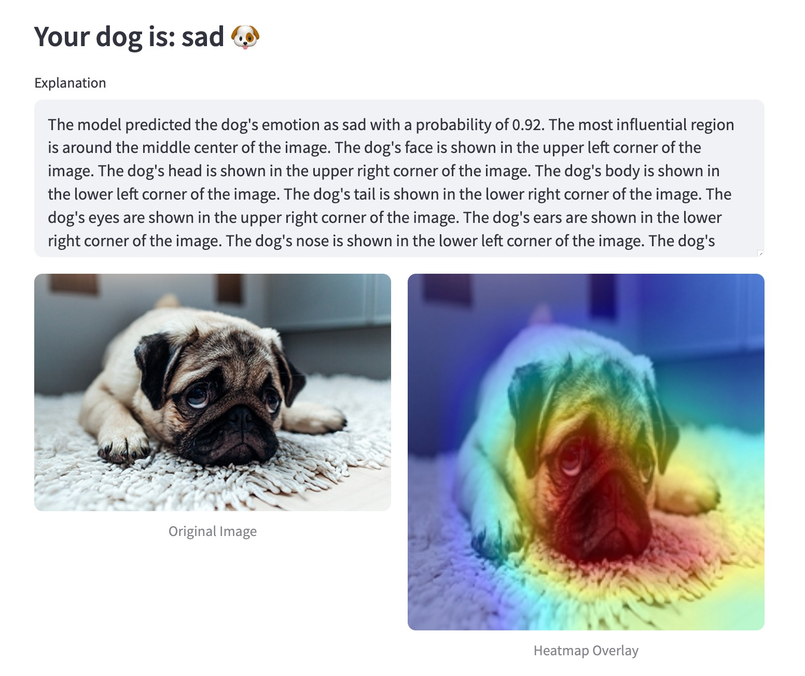

# DoggyEmotion

## **Overview**

This project focuses on developing an AI-powered system that classifies dog emotions into three categories: **Happy**, **Sad**, and **Angry**. By leveraging deep learning models such as ResNet18, Grad-CAM visualizations, and natural language explanations from a Large Language Model (LLM), the system ensures accurate predictions while enhancing transparency and usability. The solution is deployed as a **web-based application** using Streamlit, making it user-friendly for a wide range of audiences, including pet owners, veterinarians, and animal welfare professionals.

All code were ran in google colab. Data can be viewed<a href = "https://drive.google.com/drive/folders/12CAvkwqHtDM8_oEygVUJ5_a3x_ygiqRD?usp=sharing"> here </a>.

---

## **Features**

- **Emotion Classification Models**:

  - Custom CNN
  - MobileNetV2
  - Fine-tuned ResNet18 (achieving the highest accuracy of 84% and a macro-averaged ROC-AUC score of 0.955).
- **Model Interpretability**:
  - Grad-CAM visualizations to highlight regions influencing predictions.

   

  - LLM-generated natural language explanations for user-friendly insights.
- **Web Application**:
  - Intuitive interface built with Streamlit.
  - Allows users to upload images and view predictions, heatmaps, and explanations.

---

## **Repository Structure**

```plaintext
📁 DogEmotionClassification
├── CNN&MobileNetV2.ipynb       # Custom CNN and MobileNetV2 implementations
├── EDA.ipynb                   # Exploratory Data Analysis
├── ImageProcessing.ipynb       # Dataset preprocessing and augmentation
├── README.md                   # Project documentation
├── ResNet.ipynb                # ResNet18 implementation with Grad-CAM
├── WebApp_Streamlit.ipynb      # Code for the Streamlit-based web app
```

## **Setup and Installation**

1. Clone the repository:
    ```plaintext
    git clone https://github.com/Alphteow/DoggyEmotion.git
    cd DogEmotionClassification
    ```

2. Install dependencies:</br>
    2.1. Ensure Python 3.8+ is installed.</br>
    2.2. Install required libraries:
    ```bash
    pip install -r requirements.txt
    ```

3. Run the web application:</br>
    3.1. Launch the Streamlit app:
    ```bash
    streamlit run WebApp_Streamlit.ipynb
    ```

## **How it works**

1. Upload an Image:
    - Users upload an image of a dog through the web app.
2. Emotion Prediction:
    - The system classifies the image into one of three emotion categories: Happy, Sad, or Angry.
3. Visual and Textual Explanations:
    - Grad-CAM generates a heatmap showing image regions most relevant to the prediction.
    - The LLM provides a natural language explanation for the prediction to ensure transparency and usability.

## **Key Results**

- ResNet18:
    - Test Accuracy: 84%
    - Macro-Averaged ROC-AUC: 0.955
- MobileNetV2:
    - Test Accuracy: 71%
    - Macro-Averaged ROC-AUC: 0.866
- Custom CNN:
    - Test Accuracy: 55%
    - Macro-Averaged ROC-AUC: 0.722
- Grad-CAM visualizations effectively highlight critical regions, such as the dog's mouth, eyes, and ears, while LLM-generated explanations provide meaningful insights into the model’s decision-making process.

## **Examples**





## **Future Improvements**
- Expand emotion categories to include additional states like Fear, Excitement, and Anxiety.
- Incorporate multimodal inputs such as video and audio for richer insights.
- Fine-tune the LLM on domain-specific datasets to improve the accuracy and relevance of explanations.
- Adapt the system for other animals, such as cats and horses, to broaden its applications.
